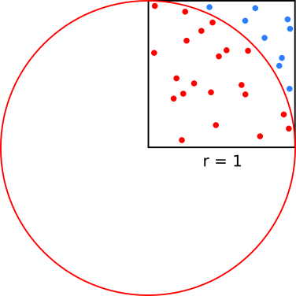

# rust-demo

Hands-on demo of the Rust programming language.


## History of Rust

- Originally designed by Graydon Hoare at Mozilla Research, with contributions from Dave Herman, Brendan Eich, and others.
- Mozilla began sponsoring the project in 2009.
- Announced 2010: http://venge.net/graydon/talks/intro-talk-2.pdf
- Rust 1.0, the first stable release, released in 2015.
- The History of Rust: https://www.youtube.com/watch?v=79PSagCD_AY
- Firefox (components Servo and Quantum) written in Rust.


## Why Rust

- "A language empowering everyone to build reliable and efficient software." (https://www.rust-lang.org)
- Fast but also safe
- Zero cost abstractions
- Type system
- Compiler catches most errors (if it compiles, it often just works)
- Compiler provides helpful error messages
- Memory safety
- Thread safety
- Private and immutable by default
- Side-effect control: pure by default
- Great tooling (testing, documentation, auto-formatter, dependency management, package registry, no makefiles needed)
- Community


## Great resources

- [Rust by Example](https://doc.rust-lang.org/rust-by-example/)
- [The Rust Programming Language](https://doc.rust-lang.org/book/)
- [The Rustonomicon](https://doc.rust-lang.org/nomicon/)
- [Why try Rust for scientific computing?](https://erambler.co.uk/blog/why-give-rust-a-try/)


## Memory model

- No explicit allocation and deallocation
- No garbage collector either
- Each value in Rust has an owner and there can only be one owner at a time.
- When the owner goes out of scope, the value is dropped.
- Rust knows the size of all stack allocations at compile time

This does not compile:
```rust
let s1 = String::from("hello");
let s2 = s1;

println!("{}, world!", s1);
```

- Rust's memory is managed a bit like money: one owner, it can be borrowed.
- We can borrow references: https://doc.rust-lang.org/book/ch04-02-references-and-borrowing.html#references-and-borrowing
- At any given time, you can have either one mutable reference or any number of immutable references.


## Installing Rust

Preferred way to install Rust for most developers: https://www.rust-lang.org/tools/install

Verify your installations of `cargo` and `rustc`:
```
$ cargo --version                                                                                                                                      (base)
cargo 1.39.0 (1c6ec66d5 2019-09-30)

$ rustc --version                                                                                                                                      (base)
rustc 1.39.0 (4560ea788 2019-11-04)
```


## Hands-on demo

In this demo we will approximate pi by generating random points and computing
their distance to origin:



Cargo check/fix/test/fmt/doc/run/publish ...

(to be written and described)


## Interfacing with C, C++, Fortran, and Python

### C calling Rust and Fortran calling Rust

```
cargo build --release

gfortran -L target/release/ -lpi examples/fortran/example.f90 -o fortran-example.x
gcc -L target/release/ -lpi examples/c/example.c -o c-example.x

env LD_LIBRARY_PATH=target/release/ ./fortran-example.x
env LD_LIBRARY_PATH=target/release/ ./c-example.x
```
