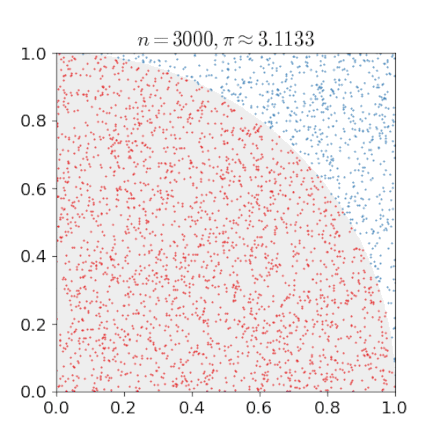

# rust-demo

Hands-on demo of the Rust programming language.


## History of Rust

- Originally designed by Graydon Hoare at Mozilla Research, with contributions from Dave Herman, Brendan Eich, and others.
- Mozilla began sponsoring the project in 2009.
- Announced 2010: http://venge.net/graydon/talks/intro-talk-2.pdf
- Rust 1.0, the first stable release, released in 2015.
- Since 2011 `rustc` is compiled using `rustc`.
- `rustc` uses LLVM as its back end.
- The History of Rust: https://www.youtube.com/watch?v=79PSagCD_AY
- Firefox (components Servo and Quantum) written in Rust.
- Ad block engine in [Brave](https://brave.com/).
- `exa`, `ripgrep`, `bat`, and `fd` written in Rust (you really want these tools!).
- Great overview of tools written in Rust: https://www.wezm.net/v2/posts/2020/100-rust-binaries/
- [Discord](https://discord.com/) uses Rust for some of its backed.


## Why Rust

- "A language empowering everyone to build reliable and efficient software." (https://www.rust-lang.org)
- Fast but also safe
- Zero cost abstractions
- Type system
- Compiler catches most errors (if it compiles, it often just works)
- Compiler provides helpful error messages
- Memory safety
- Thread safety
- Private and immutable by default
- Great tooling (testing, documentation, auto-formatter, dependency management, package registry, no makefiles needed)
- Community
- Most-loved programming language in the 2016, 2017, 2018, 2019, and 2020
  [Stack Overflow annual surveys](https://insights.stackoverflow.com/survey/)


## Great resources

- [Rust by Example](https://doc.rust-lang.org/rust-by-example/)
- [The Rust Programming Language](https://doc.rust-lang.org/book/)
- [The Rustonomicon](https://doc.rust-lang.org/nomicon/)
- [Rust Cookbook](https://rust-lang-nursery.github.io/rust-cookbook/)
- [Why try Rust for scientific computing?](https://erambler.co.uk/blog/why-give-rust-a-try/)
- [Rust in Action](http://www.rustinaction.com/)


## Memory model

- No explicit allocation and deallocation.
- No garbage collector either.
- Each value in Rust has an owner and there can only be one owner at a time.
- When the owner goes out of scope, the value is dropped.
- Rust knows the size of all stack allocations at compile time.

This does not compile:
```rust
let s1 = String::from("hello");
let s2 = s1;

println!("{}, world!", s1);
```

- Rust's memory is managed a bit like money: one owner, it can be borrowed.
- We can borrow references: https://doc.rust-lang.org/book/ch04-02-references-and-borrowing.html#references-and-borrowing
- At any given time, you can have either one mutable reference or any number of immutable references.


## Installing Rust

Preferred way to install Rust for most developers: https://www.rust-lang.org/tools/install

Verify your installations of `cargo` and `rustc`:
```
$ cargo --version
cargo 1.47.0 (f3c7e066a 2020-08-28)

$ rustc --version
rustc 1.47.0 (18bf6b4f0 2020-10-07)
```


## Hands-on demo

In this demo we will approximate pi by generating random points and computing
their distance to origin:<sup>[1](#footnote1)</sup>



Tasks/discussion points:
- Show how to bootstrap a project with `cargo new`
- Step out of the newly bootstrapped project
- Clone the code (this repository)
- Browse and discuss the sources
- Compile the sources with `cargo check`
- Compare `cargo check` and `cargo build`
- Discuss `cargo run`
- Experiment with `cargo fmt`
- Run the tests with `cargo test`
- Generate optimized version with `cargo build --release`
- Generate the documentation with `cargo doc`
- Discuss `cargo publish` and https://crates.io (the Rust package registry)


## Interfacing with C, C++, Fortran, and Python

### C calling Rust and Fortran calling Rust

```
cargo build --release

gfortran -L target/release/ -lpi examples/fortran/example.f90 -o fortran-example.x
gcc -L target/release/ -lpi examples/c/example.c -o c-example.x

env LD_LIBRARY_PATH=target/release/ ./fortran-example.x
env LD_LIBRARY_PATH=target/release/ ./c-example.x
```

### Python calling Rust

Using [PyO3](https://github.com/PyO3/pyo3) and [Maturin](https://github.com/PyO3/maturin):
```
cargo build --release
maturin develop --release
python -c "import pi; print(pi.pi_approximation(1000000))"
```

---

<a name="footnote1">1</a>: GIF from https://www.soroushjp.com/2015/02/07/go-concurrency-is-not-parallelism-real-world-lessons-with-monte-carlo-simulations/
